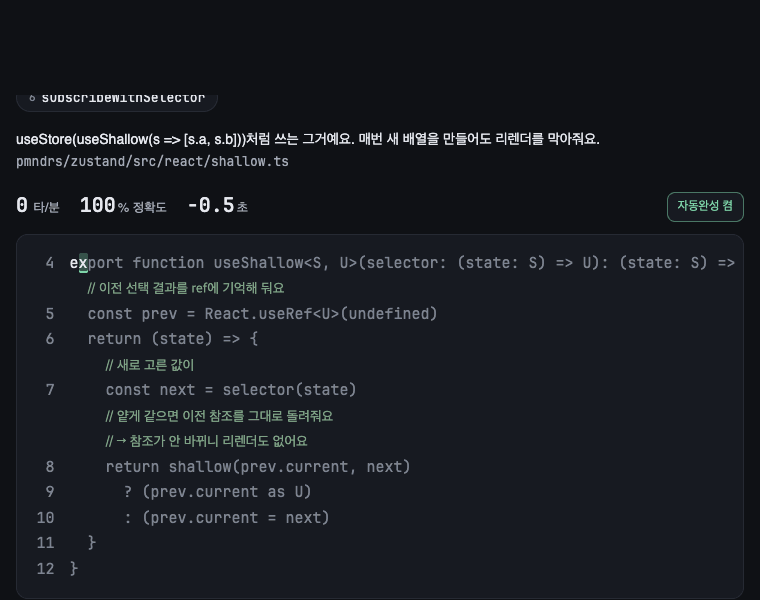
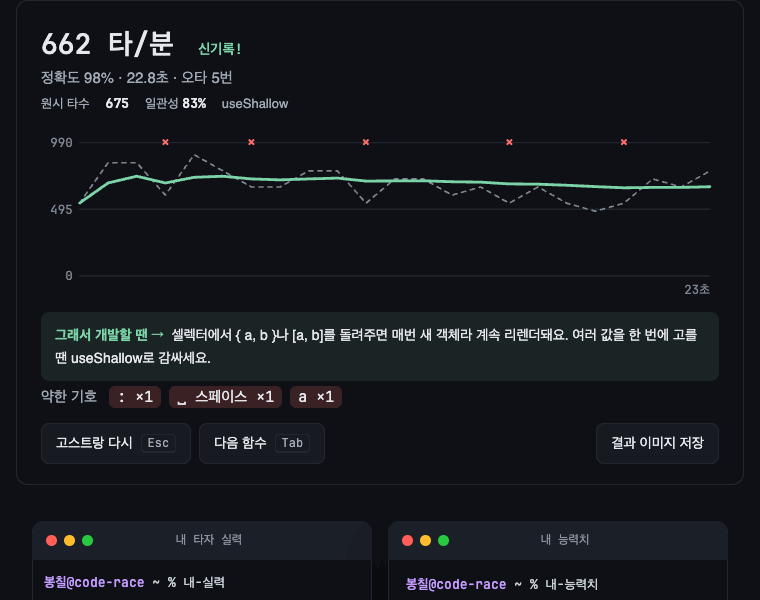
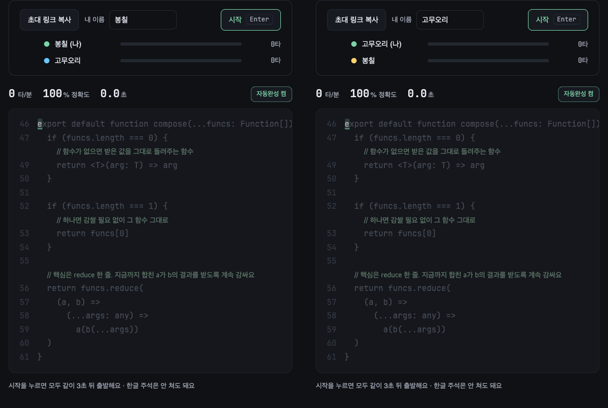
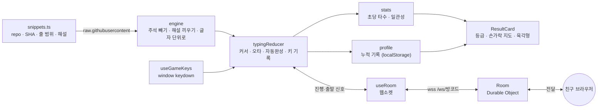

<div align="center">

# ⌨️ 코드 타자 레이스

**유명 프론트엔드 라이브러리의 실제 코드를 치면서 읽는 타자 게임**

zustand · TanStack Query · Jotai · Redux · React 코드를 한 함수씩 치면, 한글 해설과 「그래서 개발할 땐」 실무 팁이 따라와요.<br />
친구에게 초대 링크를 보내면 바로 실시간 대결이 돼요. 회사·학교 망에서도요.

### [▶ 바로 해보기 — code-race.bonchil.workers.dev](https://code-race.bonchil.workers.dev/)

[](https://github.com/E-JIWON/code-race/actions/workflows/ci.yml)
[](https://github.com/E-JIWON/code-race/actions/workflows/deploy.yml)




</div>

## 목차

[이런 게임이에요](#이런-게임이에요) · [조작법](#조작법) · [등급과 결과 카드](#등급과-결과-카드) · [친구랑 대결](#친구랑-대결) · [코스](#코스) · [시작하기](#시작하기) · [구조](#구조) · [기술 결정](#기술-결정) · [품질](#품질) · [버전 기록](#버전-기록) · [한계와 다음 할 일](#한계와-다음-할-일)

## 이런 게임이에요

|                             |                                                                                               |
| --------------------------- | --------------------------------------------------------------------------------------------- |
| 📚 **진짜 오픈소스를 친다** | 라이브러리 6개, 함수 29개. 커밋 SHA로 고정해서 원본 저장소에서 바로 가져와요                  |
| 🇰🇷 **한글 해설 주석**       | 영어 원본 주석은 빼고, 줄마다 무슨 일을 하는지 한글로 달았어요. 주석·들여쓰기는 안 쳐도 돼요  |
| 💡 **그래서 개발할 땐**     | 다 치면 실무 팁이 나와요. _"staleTime 기본값은 0이라 창 포커스 때마다 다시 받아요"_ 같은 것들 |
| ✨ **VS Code처럼 친다**     | 괄호·따옴표 자동 닫기(습관적으로 또 쳐도 OK), 단어 제안 <kbd>Tab</kbd> 완성                   |
| 📈 **Monkeytype식 결과**    | 초 단위 속도 그래프, 오타 위치, 원시 타수, 일관성, 약한 기호                                  |
| 🪪 **캐릭터 카드**          | 등급·손가락 지도·능력치 육각형·「당신은 ~ 타입이군요!」를 이미지로 저장                       |
| 👻 **고스트**               | 같은 함수를 다시 치면 내 최고 기록이 반투명 커서로 같이 달려요                                |
| 🏁 **친구랑 대결**          | 초대 링크 하나로 실시간 레이스. 3초 카운트다운, 진행 막대, 친구 커서, 순위                    |

## 조작법

| 키                              | 하는 일                                                                               |
| ------------------------------- | ------------------------------------------------------------------------------------- |
| 그냥 치기                       | 첫 글자를 맞게 치는 순간 시간이 흘러요. 주석·들여쓰기는 건너뜀                        |
| <kbd>Enter</kbd>                | 줄바꿈 (커서에 `↵`가 보일 때) · 대결 방에서는 출발                                    |
| <kbd>Tab</kbd>                  | 자동완성 제안이 떠 있으면 단어 완성, 아니면 다음 함수                                 |
| <kbd>Esc</kbd>                  | 처음부터 다시 — 끝낸 함수면 내 최고 기록 고스트와 같이 달려요                         |
| <kbd>Shift</kbd>+<kbd>Tab</kbd> | 게임에서 나와 버튼으로 이동 (버튼 위에선 Tab·Enter가 원래대로, <kbd>Esc</kbd>로 복귀) |
| 「자동완성 켬/끔」 버튼         | 자동완성 없이 손으로만 치기                                                           |

> 한/영 키가 한글이면 화면에 「영어로 바꿔 주세요」 안내가 떠요.

## 등급과 결과 카드

한 판이 끝나면 터미널 창 두 개짜리 카드가 나와요. **합쳐서 / 왼쪽만 / 오른쪽만** 이미지로 저장할 수 있어요.

<p align="center"></p>

**등급 7단계** — 위로 갈수록 좁아지게 잘랐어요.

| 등급              | 타수(분당) | 분포     |
| ----------------- | ---------- | -------- |
| 응애 개발자       | ~109       | 하위 15% |
| 뉴비 개발자       | 110~       | 15~40%   |
| 중수 개발자       | 165~       | 40~65%   |
| 고수 개발자       | 210~       | 65~85%   |
| 초고수 개발자     | 255~       | 상위 15% |
| 전설의 개발자     | 300~       | 상위 5%  |
| 킹갓제너럴 개발자 | 345~       | 상위 1%  |

**능력치 육각형** — 이번 판 기록과 지금까지 쌓인 기록을 섞어요.

| 능력치 | 계산                                                    |
| ------ | ------------------------------------------------------- |
| 속도   | 이번 판 타수 (400타 = 100)                              |
| 정확   | 이번 판 정확도 (80–100%를 0–100으로 넓힘)               |
| 리듬   | 이번 판 일관성 — 초당 타수의 변동계수 (Monkeytype 방식) |
| 기호   | 지금까지 기호(`(){}=>;` 등)를 맞게 친 비율              |
| 끈기   | 지금까지 끝낸 판 수                                     |
| 야행성 | 밤 10시~새벽 4시에 끝낸 판의 비율                       |

가장 높은 능력치로 「당신은 **정확도가 높은** 타입이군요!」 같은 한마디를 골라요. 디버프는 지금까지 가장 많이 틀린 글자로 정해져요(5번 이상 친 글자만).

## 친구랑 대결

<p align="center"></p>

1. 「친구랑 대결」을 누르고 **초대 링크 복사**
2. 친구가 링크로 들어오면 서로 이름이 보여요
3. 누구든 <kbd>Enter</kbd> → 모두 같은 함수로 3초 뒤 출발
4. 진행 막대와 친구 커서가 실시간으로 움직이고, 다 치면 순위가 떠요

각자 **같은 주소의 방 서버(Cloudflare Durable Object)에 웹소켓으로** 붙고, 방 서버는 같은 방 사람에게 메시지를 전달만 해요. 게임 상태는 각자 브라우저에 있어요.<br />
일반 웹사이트와 같은 https(443) 길이라 회사·학교 망에서도 대부분 통해요. 대결 칸 아래에 「방 서버 연결됨」이 보이고, 끊기면 알아서 다시 붙어요.

## 코스

쓰는 순서대로 이어 쳐요. 실무보다 구경거리에 가까운 함수는 「심화」로 뒤에 뒀어요.

| 라이브러리         | 함수                                                                                                                       |
| ------------------ | -------------------------------------------------------------------------------------------------------------------------- |
| **zustand**        | create → createStore → useStore → useShallow → shallow → subscribeWithSelector                                             |
| **TanStack Query** | hashKey → timeUntilStale → replaceEqualDeep → partialMatchKey → Subscribable<sup>심화</sup> → notifyManager<sup>심화</sup> |
| **Jotai**          | atom → useAtom → useSetAtom → 기본 읽기·쓰기<sup>심화</sup>                                                                |
| **Redux**          | combineReducers → dispatch → applyMiddleware → subscribe<sup>심화</sup> → compose<sup>심화</sup>                           |
| **React**          | objectIs → shallowEqual → useSyncExternalStore → checkIfSnapshotChanged<sup>심화</sup>                                     |
| **작은 명품 유틸** | clsx → nanoid → SWR stableHash → mitt                                                                                      |

## 시작하기

```bash
pnpm install
pnpm dev            # http://localhost:5173
```

| 명령                           | 하는 일                                                                                                   |
| ------------------------------ | --------------------------------------------------------------------------------------------------------- |
| `pnpm build`                   | 타입 검사(`tsc -b`) + 프로덕션 빌드                                                                       |
| `pnpm test:e2e`                | Playwright E2E 27개 (시스템 Chrome 사용)                                                                  |
| `node scripts/engine.check.ts` | 코드 파싱·자동완성·통계·등급 계산 단위 검사 (`--net`을 붙이면 29개 함수를 원본에서 받아 해설 줄까지 검증) |
| `pnpm lint` / `pnpm format`    | oxlint / prettier                                                                                         |
| `pnpm demo:gif`                | README의 GIF를 실제 플레이로 다시 찍기                                                                    |

`main`에 푸시하면 GitHub Actions가 검사(CI)하고 Cloudflare Workers로 배포해요(`pnpm deploy`로 직접 배포도 돼요). 예전 주소 `e-jiwon.github.io/code-race`는 새 주소로 넘겨줘요.

## 구조

```
src/
├─ app/App.tsx              화면 조립만
├─ features/
│  ├─ typing/               입력 리듀서 · 키 처리 · 코드 파싱 · 자동완성 · 코드 화면
│  ├─ course/               라이브러리·함수 데이터(커밋 고정) · 불러오기 · 코스 선택
│  ├─ race/                 웹소켓 방 연결 · 메시지 규격 · 카운트다운 · 대결 패널
│  └─ result/               결과 그래프 · 통계 · 누적 기록 · 캐릭터 카드
├─ shared/                  localStorage · fetch 캐시 · PNG 저장
└─ worker/                  Cloudflare Worker · 방 Durable Object (메시지 전달만)
e2e/                        Playwright (게임 22개 + 대결·연결 진단 5개)
scripts/                    단위 검사 · 데모 GIF 생성
.github/workflows/          CI · Cloudflare 배포 · 예전 주소 넘김
```



## 기술 결정

| 결정                                            | 이유                                                                                                                                                                                    |
| ----------------------------------------------- | --------------------------------------------------------------------------------------------------------------------------------------------------------------------------------------- |
| 코드를 **커밋 SHA로 고정**해서 실행 중에 불러옴 | 원본이 바뀌어도 해설 줄 번호가 안 어긋나요. 코드를 저장소에 복사하지 않아서 출처·라이선스도 깔끔해요                                                                                    |
| **입력창 없이** `window keydown`                | 글자 하나하나에 상태(맞음·오타·자동완성·고스트·친구 커서)를 그려야 해서 `<input>` 대신 직접 그려요                                                                                      |
| 입력 상태는 **리듀서 하나**                     | 키 하나가 커서·오타·자동완성·기록을 동시에 바꿔서, 순수 함수로 모아야 테스트하기 쉬워요                                                                                                 |
| 대결은 **Durable Object 웹소켓 방**             | 처음엔 서버 없는 P2P(WebRTC)였는데 회사망 방화벽에 막혀서 바꿨어요. 방 하나 = 객체 하나, 전달만 하고 하이버네이션이라 쉴 땐 비용 0. 개발 서버에서도 로컬로 같이 떠서 E2E가 안정적이에요 |
| 이미지 저장은 **html-to-image**                 | 카드를 화면 그대로 PNG로. SVG 색은 CSS 클래스 대신 `fill` 속성으로 칠해요(클래스 색이 저장 때 빠짐)                                                                                     |
| 기능별 폴더 + 배럴 파일 없음                    | 작은 앱이라 `features/*`만으로 충분하고, 불필요한 간접 참조를 피했어요                                                                                                                  |
| 결과 카드는 **컨테이너 쿼리**                   | 화면 폭이 아니라 카드 폭 기준으로 키보드를 줄여야 두 창이 나란히 좁아질 때도 안 잘려요                                                                                                  |

<details>
<summary><b>구현 메모 더 보기</b></summary>

- **주석 처리**: 줄 단위 스캐너가 문자열·템플릿 리터럴을 피해서 `//`, `/* */`, docstring을 찾아 원본 주석을 빼고, 한글 해설을 같은 들여쓰기로 끼워 넣어요. 긴 에러 메시지 덩어리는 `… (생략)`으로 접어요.
- **자동완성 덮어쓰기**: 한 번에 건너뛴 닫는 글자들(`])` 등)을 순서대로 기억해서, 그중 어느 것을 습관적으로 쳐도 그 지점까지는 오타로 안 쳐요.
- **등급·상위 %**: 공개된 코드 타자 분포가 없어서, 문장 타자 연구(평균 52WPM, [Dhakal et al. CHI 2018](https://userinterfaces.aalto.fi/136Mkeystrokes/))에 코드 보정 0.7을 곱한 정규분포(평균 182타, 표준편차 70)로 추정해요.
- **개발 모드 대결**: StrictMode가 effect를 두 번 돌려 웹소켓을 열자마자 닫으면 서버에 유령 참가자가 남아서, 소켓을 한 박자 늦게 열고 서버는 인사한 사람만 참가자로 보여줘요.
- **데모 GIF**: `scripts/demo-gif.ts`가 Playwright로 실제 플레이를 찍어 gifenc로 묶어요(ffmpeg 불필요).

</details>

## 품질

**테스트**

| 층        | 도구                                    | 다루는 것                                                                                                            |
| --------- | --------------------------------------- | -------------------------------------------------------------------------------------------------------------------- |
| 단위      | `scripts/engine.check.ts` (node:assert) | 주석 파싱, 괄호 짝, 키 기록 통계, 일관성, 등급 경계, 오타율 · `--net`으로 29개 함수 원본 검증                        |
| E2E       | Playwright 27개 (시스템 Chrome)         | 완주, 오타, 한글 입력, Esc/Tab, 자동완성, 카드 저장 4종, 저장소 유지, 375·760px, 키보드만으로 조작, 두 브라우저 대결 |
| 정적 검사 | TypeScript strict · oxlint · prettier   | CI에서 매 푸시마다                                                                                                   |

**Lighthouse** (실제 배포 주소 기준)

|          | 성능  | 접근성 | 권장사항 | SEO |
| -------- | ----- | ------ | -------- | --- |
| 모바일   | 75–87 | 100    | 100      | 100 |
| 데스크톱 | 86    | 100    | 100      | 100 |

모바일 성능은 느린 회선을 흉내 내서 측정마다 흔들려요. 로컬(네트워크 지연 0)에선 97 / 100이에요. 해시 붙은 JS·CSS는 1년 캐시, 문제 코드를 받아오는 `raw.githubusercontent.com`엔 미리 연결(preconnect)해 둬요.

**UI QA** — 375 · 768 · 1280px에서 처음 화면 · 치는 중 · 결과 · 대결 방을 점검했어요. 콘솔 오류 0, 실패한 요청 0, 가로 넘침 0. 이때 고친 것들이에요.

- 아직 안 친 코드와 줄 번호의 글자 대비가 낮음(2.9:1, 1.8:1) → 4.6:1로 올림
- <kbd>Tab</kbd>을 게임이 써서 키보드만으로는 버튼에 갈 수 없음 → <kbd>Shift</kbd>+<kbd>Tab</kbd> 길 추가
- 좁은 화면에서 치다 보면 커서가 코드 상자 밖으로 나감 → 커서를 따라 스크롤
- 설명·테마색 메타 태그 추가, 휴대폰에서 긴 원본 경로가 화면 끝까지 붙는 문제

**E2E로 잡은 버그** — 처음 E2E를 붙였을 때 실제로 찾아서 고친 것들이에요.

| 버그                                                            | 원인 · 수정                                                 |
| --------------------------------------------------------------- | ----------------------------------------------------------- |
| 개발 서버에서 대결 방이 서로 안 보임 (P2P 시절)                 | StrictMode join→leave→join → 나가기를 늦추고 같은 방 재사용 |
| 대결 시작 후 이름 칸에 포커스가 남은 친구는 키가 안 먹음        | 출발 신호에서 포커스 해제                                   |
| 자동완성으로 `))`를 한 번에 건너뛴 뒤 둘 다 치면 두 번째가 오타 | 건너뛴 글자를 하나가 아니라 줄로 기억                       |
| 휴대폰·좁은 두 창에서 결과 카드 키보드 오른쪽이 잘림            | 컨테이너 쿼리로 카드 폭 기준 축소                           |
| 불러오기 실패 후 「다시 시도」가 엉뚱한 함수를 부름             | 요청한 함수를 기억                                          |
| 방에 들어오자마자 이름을 바꾸면 친구 화면에 예전 이름이 남음    | 방 서버의 메시지 간격 제한에서 이름·출발·완주 신호는 제외   |
| 개발 모드에서 이름 없는 유령 참가자가 생김                      | 소켓을 한 박자 늦게 열고, 서버는 인사한 사람만 참가자로     |

## 버전 기록

| 버전   | 내용                                                                            |
| ------ | ------------------------------------------------------------------------------- |
| v1.3.0 | 대결을 Cloudflare Durable Object 웹소켓으로 전환 (회사망 대응), Cloudflare 배포 |
| v1.2.0 | 접근성(키보드 조작·대비), README 상세화                                         |
| v1.1.0 | 등급 7단계(응애 개발자 ~ 킹갓제너럴), 좁은 폭 결과 카드 잘림 수정               |
| v1.0.0 | README · 데모 GIF, 첫 공개 버전                                                 |
| v0.8.0 | 기능별 폴더 구조, Playwright E2E, 버그 5개 수정                                 |
| v0.7.0 | 결과 화면 캐릭터 카드 (누적 기록 · 손가락 지도 · 능력치 · 이미지 저장)          |
| v0.6.0 | Monkeytype식 결과 그래프 · 원시 타수 · 일관성                                   |
| v0.5.0 | 사용 흐름 순서 코스 + 「그래서 개발할 땐」 실무 팁                              |
| v0.4.0 | VS Code식 자동완성                                                              |
| v0.3.0 | 프론트 라이브러리 코스 + 한글 해설 주석                                         |
| v0.2.0 | 친구랑 실시간 대결                                                              |
| v0.1.0 | 첫 버전                                                                         |

## 한계와 다음 할 일

- 기록은 각자 브라우저(localStorage)에만 저장돼요. 랭킹은 없어요.
- 아주 엄격한 망(허용된 사이트만 열리는 망분리)에선 `workers.dev` 주소 자체가 막힐 수 있어요. 그땐 휴대폰 핫스팟을 써야 해요.
- 등급 경계와 상위 %는 추정값이라, 실제 플레이 데이터가 쌓이면 보정이 필요해요.
- 물리 키보드 전용이에요. 휴대폰에서는 결과·카드만 보기 좋게 맞췄어요.
- 다음: 코스 늘리기(Vue · Svelte · React Hook Form), 공유 링크 미리보기(OG 이미지)

## 크레딧

게임에 나오는 코드는 각 저장소의 원본(모두 MIT 라이선스)을 실행할 때 그대로 불러와 보여주고, 화면마다 원본 링크를 달아요.
[zustand](https://github.com/pmndrs/zustand) · [TanStack Query](https://github.com/TanStack/query) · [Jotai](https://github.com/pmndrs/jotai) · [Redux](https://github.com/reduxjs/redux) · [React](https://github.com/facebook/react) · [clsx](https://github.com/lukeed/clsx) · [nanoid](https://github.com/ai/nanoid) · [mitt](https://github.com/developit/mitt) · [SWR](https://github.com/vercel/swr)<br />
한글 해설과 실무 팁은 직접 썼어요.
